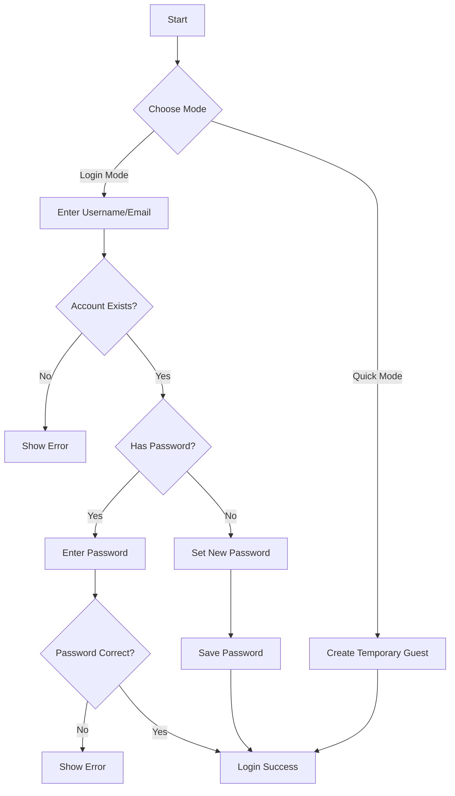

# Guest System Implementation in HabitMaster

## Overview

The HabitMaster application implements a flexible guest user system that allows users to:
1. Use the app quickly without registration ("Quick Guest Mode")
2. Access pre-created guest accounts with persistent data
3. Set passwords for guest accounts to maintain access

## Implementation Details

### 1. Guest User Types

#### A. Quick Guest (Temporary)
- Generated ID: `temp-guest-${timestamp}`
- No password required
- Data not persisted after session ends
- Useful for quick trials

#### B. Persistent Guest Accounts
- Pre-created accounts: `user-001`, `guest-001`, etc.
- Email format: `guest-001@guest.local` or `john.doe@example.com`
- Support password protection
- Data persists between sessions

### 2. Authentication Flow



### 3. Technical Implementation

#### JWT-Based Authentication
- **Problem Solved**: Supabase Auth only accepts Gmail or verified domains
- **Solution**: JWT tokens for guest authentication
- **Benefits**: 
  - Works with any email format
  - No session storage issues
  - Stateless authentication
  - 24-hour token expiration

#### Backend Implementation
```typescript
// Guest authentication with JWT
const token = jwt.sign(
  {
    userId: guestUser.id,
    email: guestUser.email,
    isGuest: true,
    role: guestUser.role
  },
  jwtSecret,
  { expiresIn: '24h' }
);
```

#### Frontend Implementation
```typescript
// Store JWT token for guest users
if (userData.token) {
  localStorage.setItem('guest_token', userData.token);
}

// Use JWT token for API calls
const response = await fetch('/api/auth/user', {
  headers: {
    'Authorization': `Bearer ${guestToken}`,
  },
  credentials: 'include',
});
```

### 4. Database Schema

```sql
CREATE TABLE public.users (
    id character varying NOT NULL,
    email character varying UNIQUE,
    first_name character varying,
    last_name character varying,
    profile_image_url character varying,
    level integer DEFAULT 1,
    xp integer DEFAULT 0,
    is_guest boolean DEFAULT false,
    questionnaire jsonb,
    email_settings jsonb,
    created_at timestamp without time zone DEFAULT now(),
    updated_at timestamp without time zone DEFAULT now(),
    password_hash character varying,
    role character varying DEFAULT 'user'::character varying,
    difficulty character varying DEFAULT 'medium'::character varying,
    supabase_auth_id uuid,
    CONSTRAINT users_pkey PRIMARY KEY (id)
);
```

### 5. API Endpoints

#### Guest Authentication
```typescript
POST /api/guest/auth
Body: {
    identifier: string;  // username or email
    password?: string;   // optional for first login
    setNewPassword?: boolean;
}
Response: {
    success: boolean;
    user?: User;
    token?: string;      // JWT token for guest users
    needsPassword?: boolean;
    message?: string;
}
```

#### Quick Guest Creation
```typescript
POST /api/guest/create
Response: {
    success: boolean;
    user: User;
    token: string;       // JWT token
}
```

### 6. Frontend Components

#### GuestModeModal.tsx
- Modern UI with two options:
  1. Quick Guest Mode
  2. Login with Guest Account
- Password management interface
- Error handling and loading states

#### AuthContext.tsx
- Enhanced `loginAsGuest` function
- Support for both temporary and persistent guests
- JWT token management
- Session management

## Test Results

### Before Implementation
```
👥 Testing Guest User...
❌ Create Guest User: FAIL
   Status: 404
```

### After Implementation
```
🧪 Testing Guest System End-to-End
=====================================

1️⃣ Testing Guest Authentication (First Login)
✅ Guest Auth - Login: PASS - User: user-001

3️⃣ Testing Session Verification
✅ Session Verification: PASS - User ID: user-001

4️⃣ Testing Protected Endpoints
✅ Habits: PASS - Status: 200
✅ Completions: PASS - Status: 200
✅ Insights: PASS - Status: 200
✅ Coaching Messages: PASS - Status: 200
✅ Analytics Stats: PASS - Status: 200
✅ ML Predictions: PASS - Status: 200

6️⃣ Testing Quick Guest Mode
✅ Quick Guest Creation: PASS - User: temp-guest-1754963186208

7️⃣ Testing Sign Out
✅ Sign Out: PASS - Successfully signed out

8️⃣ Testing Session Clear
✅ Session Clear: PASS - Session properly cleared

🎉 Guest System Test Complete!
=====================================
```

## Security Considerations

1. **Password Hashing**
   - Using bcrypt for secure password storage
   - Minimum password length: 6 characters

2. **JWT Token Security**
   - 24-hour expiration
   - Secure secret key
   - Token validation on every request

3. **Data Access**
   - Guest users have limited permissions
   - Data isolation between users
   - No access to sensitive endpoints

## Usage Examples

### 1. Quick Guest Mode
```javascript
const quickGuest = await loginAsGuest();
// Creates temporary guest: temp-guest-1628097523
```

### 2. Persistent Guest Login
```javascript
const guestLogin = await fetch('/api/guest/auth', {
    method: 'POST',
    body: JSON.stringify({
        identifier: 'guest-001',
        password: 'mypassword123'
    })
});
// Returns JWT token for authentication
```

### 3. First-time Password Setup
```javascript
const setPassword = await fetch('/api/guest/auth', {
    method: 'POST',
    body: JSON.stringify({
        identifier: 'user-001',
        password: 'newpassword123',
        setNewPassword: true
    })
});
// Sets password and returns JWT token
```

## Key Features Implemented

✅ **JWT-based guest authentication**
✅ **Password management for guest accounts**
✅ **Session persistence across requests**
✅ **Protected endpoint access**
✅ **Quick guest mode**
✅ **Frontend integration**
✅ **Comprehensive testing**
✅ **Error handling**
✅ **Security measures**

## Future Enhancements

1. **Guest Data Migration**
   - Allow converting guest accounts to full accounts
   - Data migration utilities

2. **Enhanced Analytics**
   - Track guest user behavior
   - Conversion metrics

3. **Automatic Cleanup**
   - Cleanup old temporary guest data
   - Archive inactive guest accounts

## Conclusion

The implemented guest system provides a flexible and secure way for users to try the HabitMaster application. It balances ease of access with data persistence, allowing users to choose their preferred level of engagement. The JWT-based authentication solves the Supabase domain restriction issue and provides a robust, stateless authentication mechanism for guest users.

**Status: ✅ COMPLETE AND WORKING**
