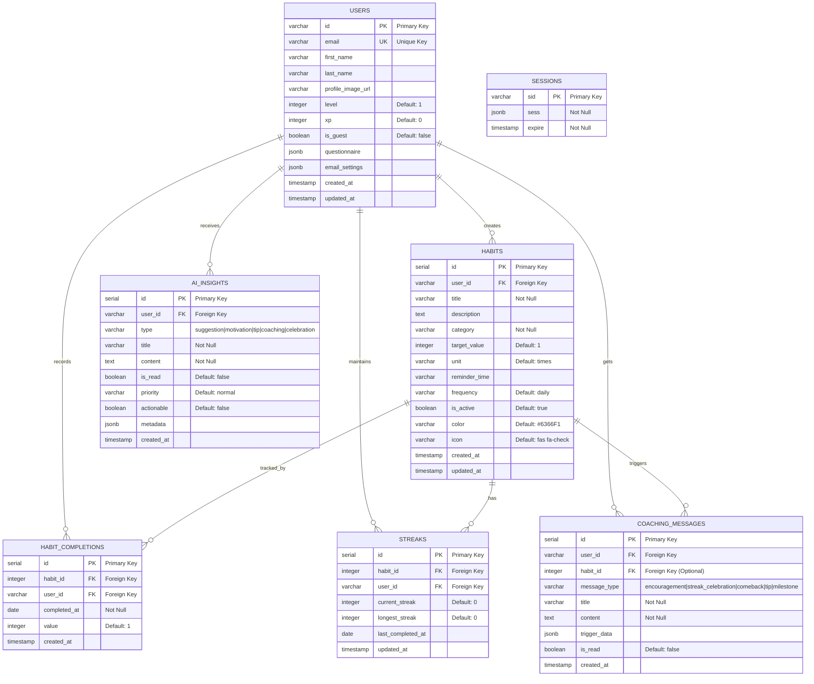
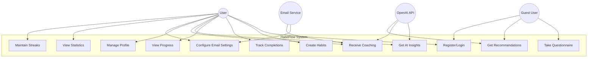
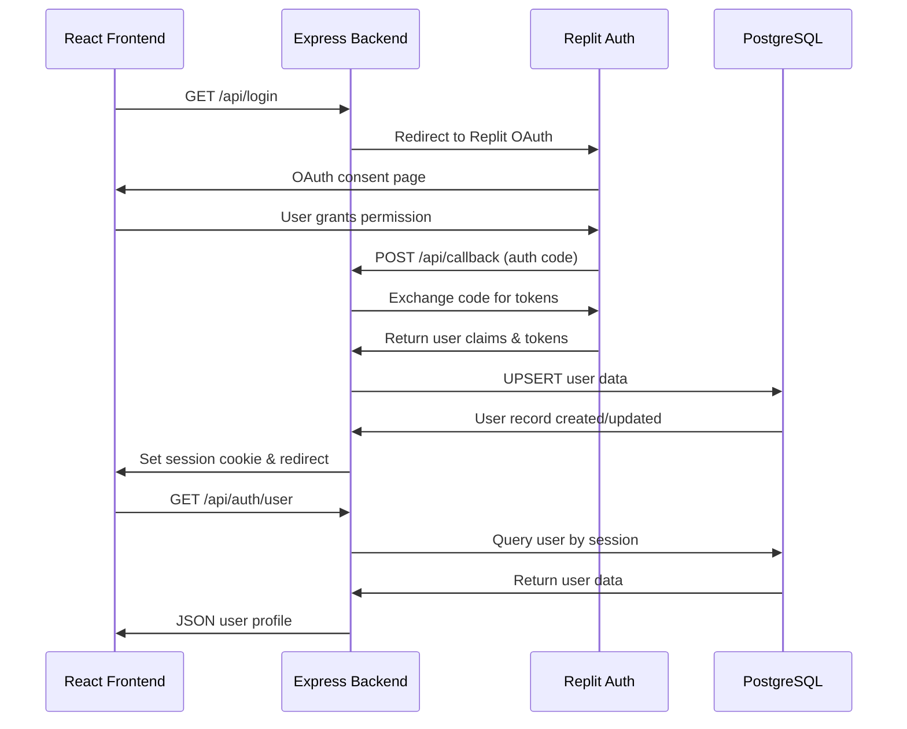
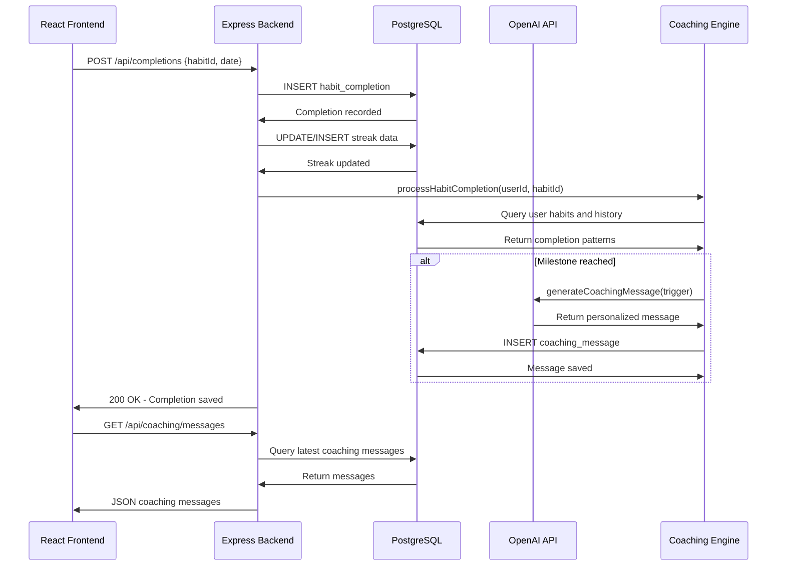
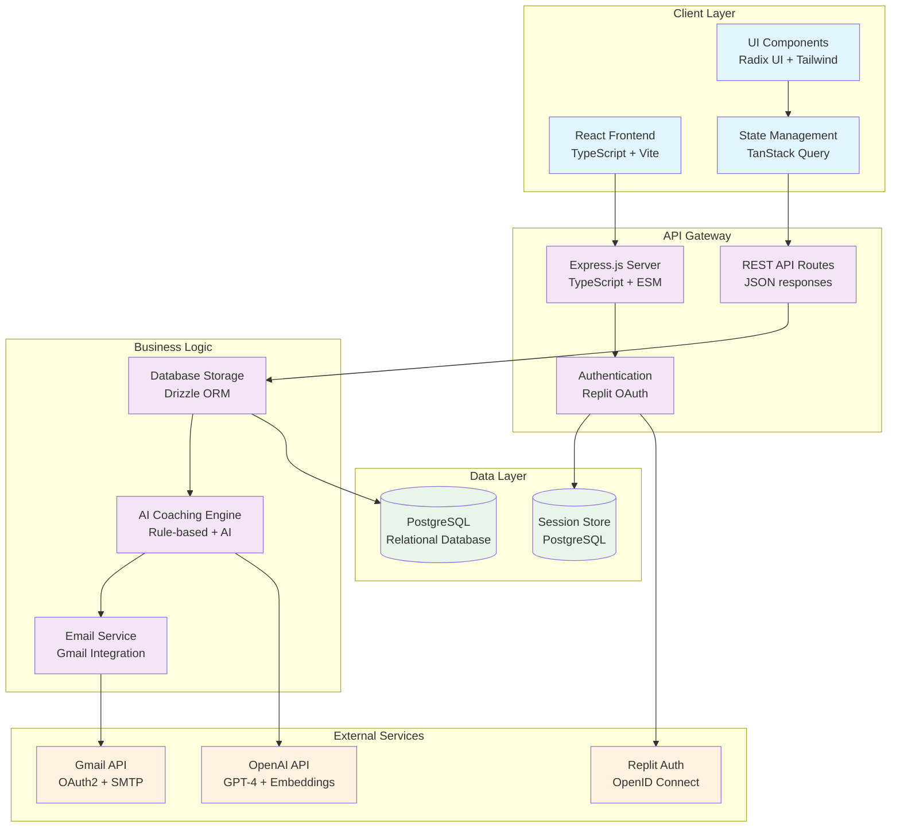

# HabitFlow - Complete System Design Documentation

## 1. Entity-Relationship (ER) Diagram



## 2. Use Case Diagram



## 3. Sequence Diagrams

### 3.1 User Authentication Flow



### 3.2 Habit Completion Flow with AI Coaching



## 4. Backend Database Schema

### 4.1 Complete Table Structure

```sql
-- Users table (Authentication & Profile)
CREATE TABLE users (
    id VARCHAR PRIMARY KEY,
    email VARCHAR UNIQUE,
    first_name VARCHAR,
    last_name VARCHAR,
    profile_image_url VARCHAR,
    level INTEGER DEFAULT 1,
    xp INTEGER DEFAULT 0,
    is_guest BOOLEAN DEFAULT false,
    questionnaire JSONB,
    email_settings JSONB,
    created_at TIMESTAMP DEFAULT NOW(),
    updated_at TIMESTAMP DEFAULT NOW()
);

-- Habits table (Core habit definitions)
CREATE TABLE habits (
    id SERIAL PRIMARY KEY,
    user_id VARCHAR NOT NULL REFERENCES users(id),
    title VARCHAR NOT NULL,
    description TEXT,
    category VARCHAR NOT NULL,
    target_value INTEGER DEFAULT 1,
    unit VARCHAR DEFAULT 'times',
    reminder_time VARCHAR,
    frequency VARCHAR DEFAULT 'daily',
    is_active BOOLEAN DEFAULT true,
    color VARCHAR DEFAULT '#6366F1',
    icon VARCHAR DEFAULT 'fas fa-check',
    created_at TIMESTAMP DEFAULT NOW(),
    updated_at TIMESTAMP DEFAULT NOW()
);

-- Habit completions (Daily tracking data)
CREATE TABLE habit_completions (
    id SERIAL PRIMARY KEY,
    habit_id INTEGER NOT NULL REFERENCES habits(id),
    user_id VARCHAR NOT NULL REFERENCES users(id),
    completed_at DATE NOT NULL,
    value INTEGER DEFAULT 1,
    created_at TIMESTAMP DEFAULT NOW(),
    UNIQUE(habit_id, user_id, completed_at)
);

-- Streaks (Calculated motivation metrics)
CREATE TABLE streaks (
    id SERIAL PRIMARY KEY,
    habit_id INTEGER NOT NULL REFERENCES habits(id),
    user_id VARCHAR NOT NULL REFERENCES users(id),
    current_streak INTEGER DEFAULT 0,
    longest_streak INTEGER DEFAULT 0,
    last_completed_at DATE,
    updated_at TIMESTAMP DEFAULT NOW(),
    UNIQUE(habit_id, user_id)
);

-- AI insights (Personalized recommendations)
CREATE TABLE ai_insights (
    id SERIAL PRIMARY KEY,
    user_id VARCHAR NOT NULL REFERENCES users(id),
    type VARCHAR NOT NULL, -- suggestion, motivation, tip, coaching, celebration
    title VARCHAR NOT NULL,
    content TEXT NOT NULL,
    is_read BOOLEAN DEFAULT false,
    priority VARCHAR DEFAULT 'normal', -- high, normal, low
    actionable BOOLEAN DEFAULT false,
    metadata JSONB,
    created_at TIMESTAMP DEFAULT NOW()
);

-- Coaching messages (AI-driven guidance)
CREATE TABLE coaching_messages (
    id SERIAL PRIMARY KEY,
    user_id VARCHAR NOT NULL REFERENCES users(id),
    habit_id INTEGER REFERENCES habits(id),
    message_type VARCHAR NOT NULL, -- encouragement, streak_celebration, comeback, tip, milestone
    title VARCHAR NOT NULL,
    content TEXT NOT NULL,
    trigger_data JSONB,
    is_read BOOLEAN DEFAULT false,
    created_at TIMESTAMP DEFAULT NOW()
);

-- Sessions (Authentication state)
CREATE TABLE sessions (
    sid VARCHAR PRIMARY KEY,
    sess JSONB NOT NULL,
    expire TIMESTAMP NOT NULL
);

-- Indexes for performance
CREATE INDEX idx_habits_user_id ON habits(user_id);
CREATE INDEX idx_habit_completions_user_id ON habit_completions(user_id);
CREATE INDEX idx_habit_completions_date ON habit_completions(completed_at);
CREATE INDEX idx_streaks_user_id ON streaks(user_id);
CREATE INDEX idx_ai_insights_user_id ON ai_insights(user_id);
CREATE INDEX idx_coaching_messages_user_id ON coaching_messages(user_id);
CREATE INDEX idx_sessions_expire ON sessions(expire);
```

### 4.2 Relationship Constraints

```sql
-- Foreign Key Relationships
ALTER TABLE habits ADD CONSTRAINT fk_habits_user 
    FOREIGN KEY (user_id) REFERENCES users(id) ON DELETE CASCADE;

ALTER TABLE habit_completions ADD CONSTRAINT fk_completions_habit 
    FOREIGN KEY (habit_id) REFERENCES habits(id) ON DELETE CASCADE;

ALTER TABLE habit_completions ADD CONSTRAINT fk_completions_user 
    FOREIGN KEY (user_id) REFERENCES users(id) ON DELETE CASCADE;

ALTER TABLE streaks ADD CONSTRAINT fk_streaks_habit 
    FOREIGN KEY (habit_id) REFERENCES habits(id) ON DELETE CASCADE;

ALTER TABLE streaks ADD CONSTRAINT fk_streaks_user 
    FOREIGN KEY (user_id) REFERENCES users(id) ON DELETE CASCADE;

ALTER TABLE ai_insights ADD CONSTRAINT fk_insights_user 
    FOREIGN KEY (user_id) REFERENCES users(id) ON DELETE CASCADE;

ALTER TABLE coaching_messages ADD CONSTRAINT fk_coaching_user 
    FOREIGN KEY (user_id) REFERENCES users(id) ON DELETE CASCADE;

ALTER TABLE coaching_messages ADD CONSTRAINT fk_coaching_habit 
    FOREIGN KEY (habit_id) REFERENCES habits(id) ON DELETE SET NULL;
```

## 5. System Architecture Diagram



## 6. API Endpoint Documentation

### 6.1 Authentication Endpoints
```
GET /api/login           - Initiate OAuth login
GET /api/callback        - OAuth callback handler
GET /api/logout          - User logout
GET /api/auth/user       - Get current user profile
```

### 6.2 Habit Management
```
GET /api/habits          - Get user's habits
POST /api/habits         - Create new habit
PUT /api/habits/:id      - Update habit
DELETE /api/habits/:id   - Delete habit
```

### 6.3 Completion Tracking
```
GET /api/completions     - Get completions (with date filter)
POST /api/completions    - Record habit completion
DELETE /api/completions  - Remove completion
```

### 6.4 AI Features
```
GET /api/insights        - Get AI insights for user
POST /api/insights/generate - Generate new insights
GET /api/coaching/messages - Get coaching messages
POST /api/coach/ask      - Ask AI coach a question
```

### 6.5 User Management
```
PUT /api/users/profile   - Update user profile
PUT /api/users/email-settings - Configure email preferences
POST /api/users/guest    - Create guest user
```

## 7. Data Flow Architecture

### 7.1 Frontend → Backend → Database Flow

```
User Action (React) 
    ↓
Component Event Handler 
    ↓
TanStack Query Mutation 
    ↓
HTTP Request (JSON) 
    ↓
Express Route Handler 
    ↓
Request Validation (Zod) 
    ↓
Storage Interface Method 
    ↓
Drizzle ORM Query 
    ↓
PostgreSQL Database 
    ↓
Response Data 
    ↓
JSON Response 
    ↓
React State Update 
    ↓
UI Re-render
```

### 7.2 AI Integration Flow

```
User Trigger Event 
    ↓
Coaching Engine Activation 
    ↓
Context Data Collection 
    ↓
OpenAI API Request 
    ↓
AI Response Processing 
    ↓
Database Storage 
    ↓
Real-time UI Update
```

This documentation provides complete system design coverage for academic presentation and viva preparation.